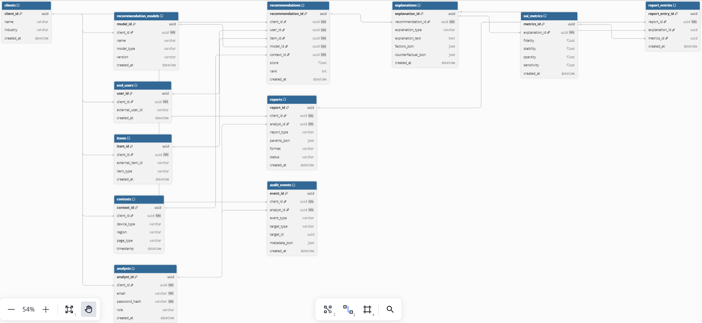
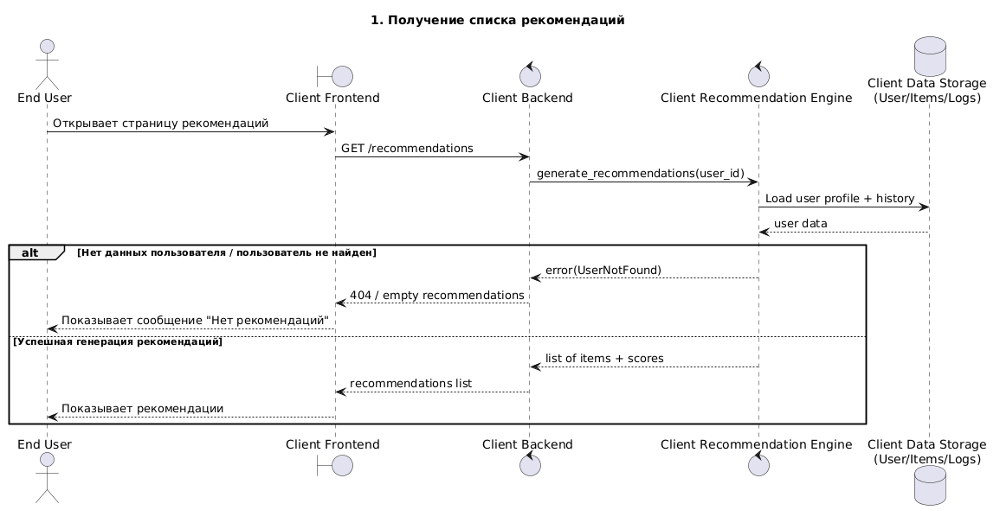
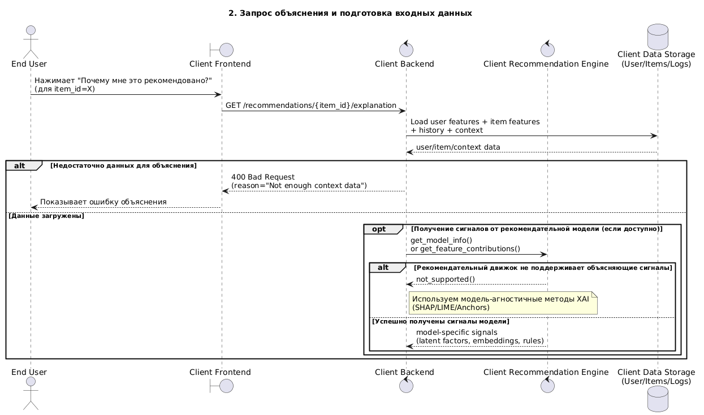
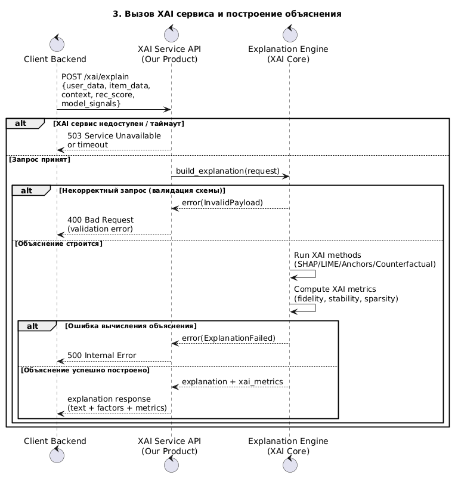
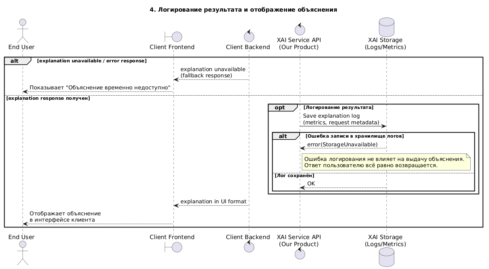

# 1. Описание продукта
## 1.1. Краткое описание

Разрабатываемый продукт представляет собой информационную систему объяснимости рекомендательных решений (Explainable Recommender Systems, XAI for RecSys), предназначенную для интеграции с рекомендательными движками различных типов. 
## 1.2. Цели и задачи

Цель-создание универсального XAI-слоя, который может подключаться к существующим рекомендательным системам и предоставлять объяснения, интерпретируемые как разработчиками и аналитиками, так и конечными пользователями.

Продукт предназначен для решения следующих задач:

- предоставление объяснений к рекомендациям в человекочитаемом виде;
- анализ факторов, повлиявших на формирование рекомендаций;
- вычисление метрик качества объяснимости (например, fidelity, stability);
- поддержка нескольких моделей и возможность их сравнения
- обеспечение удобного интерфейса для анализа рекомендаций.
## 1.3. Обоснование выбора темы

Проект соответствует требованиям, так как 
- представляет собой концепцию информационной системы
- включает бэкэнд (серверная логика, API) и фронтенд (веб-интерфейс)
- Не требует железной части - полностью программное решение.

---
# 2. Use cases, User Stories, Требования
## 2.1. Use Cases
| ID    | Название                                    | Актор                 | Описание                                                                                                |
| ----- | ------------------------------------------- | --------------------- | ------------------------------------------------------------------------------------------------------- |
| UC-01 | Регистрация клиента (Tenant)                | Администратор системы | Создание новой организации-клиента в системе и выдача доступа к API.                                    |
| UC-02 | Настройка API-ключа клиента                 | Администратор системы | Генерация и управление ключами доступа для интеграции клиента с XAI API.                                |
| UC-03 | Подключение рекомендательной модели клиента | Разработчик клиента   | Клиент регистрирует свою модель (тип, версия, параметры), чтобы получать объяснения рекомендаций.       |
| UC-04 | Отправка запроса на объяснение рекомендации | Backend клиента       | Backend клиента отправляет данные о пользователе, объекте и рекомендации в XAI API.                     |
| UC-05 | Генерация объяснения рекомендации           | XAI-система           | Система выполняет алгоритмы объяснимости (например SHAP/LIME/контрфакты) и формирует объяснение.        |
| UC-06 | Получение объяснения рекомендации           | Backend клиента       | Клиент получает результат объяснения в виде текста, факторов и метрик качества.                         |
| UC-07 | Отображение объяснения пользователю         | Frontend клиента      | Интерфейс клиента показывает конечному пользователю объяснение рекомендации.                            |
| UC-08 | Сохранение логов объяснений                 | XAI-система           | Система сохраняет факт запроса, объяснение и метрики в базу данных для аудита и аналитики.              |
| UC-09 | Просмотр истории объяснений                 | Аналитик клиента      | Аналитик открывает веб-интерфейс и просматривает историю запросов и объяснений.                         |
| UC-10 | Просмотр XAI-метрик по модели               | Аналитик клиента      | Аналитик анализирует метрики fidelity/stability/sparsity по выбранной модели.                           |
| UC-11 | Сравнение объяснений разных моделей         | Аналитик клиента      | Аналитик сравнивает объяснения и метрики разных моделей для выбора оптимальной.                         |
| UC-12 | Выявление подозрительных рекомендаций       | Аналитик клиента      | Аналитик находит рекомендации с низкой fidelity или высокой нестабильностью, фиксирует проблему.        |
| UC-13 | Генерация контрфактического объяснения      | Разработчик клиента   | Разработчик запрашивает контрфактические примеры, чтобы понять, какие изменения влияют на рекомендацию. |
| UC-14 | Экспорт отчета по объяснимости              | Аналитик клиента      | Аналитик выгружает отчет по объяснениям и метрикам для презентации бизнесу или аудита.                  |
## 2.2. User Stories
- Как **разработчик рекомендательных систем**, я хочу **подключать свою модель рекомендаций через единый API**, чтобы **не переписывать код под каждую систему объяснений**.
- Как **разработчик рекомендательных систем**, я хочу **получать декомпозицию итогового recommendation score**, чтобы **понимать вклад факторов и выявлять ошибки модели**.
- Как **разработчик рекомендательных систем**, я хочу **сравнивать объяснения разных моделей**, чтобы **выбрать наиболее корректную и интерпретируемую модель**.
- Как **разработчик рекомендательных систем**, я хочу **получать контрфактические объяснения**, чтобы **понимать, какие изменения данных влияют на рекомендацию**.
- Как **разработчик рекомендательных систем**, я хочу **видеть метрики качества объяснения (fidelity, stability и др.)**, чтобы **объективно оценивать качество XAI**.
- Как **бизнес-аналитик**, я хочу **видеть человекочитаемые объяснения рекомендаций**, чтобы **понимать логику работы рекомендаций и оценивать их адекватность**.
- Как **бизнес-аналитик**, я хочу **получать отчеты по ошибочным или подозрительным рекомендациям**, чтобы **выявлять бизнес-риски и снижать негатив для пользователей**.
- Как **владелец продукта**, я хочу **видеть общие метрики объяснимости по сервису**, чтобы **контролировать качество рекомендаций и доверие пользователей**.
- Как **аналитик клиента**, я хочу **работать с веб-интерфейсом для просмотра логов объяснений**, чтобы **проводить аудит решений рекомендательной модели**.
- Как **конечный пользователь сервиса**, я хочу **нажать кнопку “Почему мне это рекомендовано?”**, чтобы **получить понятное объяснение и больше доверять сервису**.
- Как **конечный пользователь сервиса**, я хочу **получить объяснение в простой форме**, чтобы **не читать технические детали и быстро понять причину рекомендации**.
- Как **конечный пользователь сервиса**, я хочу **видеть, что нужно изменить в моих действиях/интересах, чтобы рекомендации стали другими**, чтобы **управлять персонализацией**.
## 2.3. Функциональные требования

| ID    | Функциональное требование                                                                                                                                                  | Приоритет | Критерий приемки                                                                                                        |
| ----- | -------------------------------------------------------------------------------------------------------------------------------------------------------------------------- | --------- | ----------------------------------------------------------------------------------------------------------------------- |
| FR-01 | Система должна предоставлять REST API для запроса объяснений рекомендаций.                                                                                                 | M         | API принимает запрос и возвращает explanation response в JSON.                                                          |
| FR-02 | Система должна поддерживать интеграцию с внешними рекомендательными движками через единый интерфейс (adapter layer).                                                       | M         | Клиент может подключить модель через стандартный формат входных данных без изменения ядра XAI.                          |
| FR-03 | Система должна принимать от клиента данные о пользователе, объекте рекомендации и контексте (user/item/context).                                                           | M         | API корректно принимает и валидирует входные данные.                                                                    |
| FR-04 | Система должна формировать объяснение рекомендации в виде факторов, влияющих на итоговый score.                                                                            | M         | Ответ содержит список факторов/признаков и их вклад.                                                                    |
| FR-05 | Система должна поддерживать генерацию объяснений методами model-agnostic XAI (например, LIME/SHAP/Anchors).                                                                | M         | При запросе объяснение формируется выбранным методом.                                                                   |
| FR-06 | Система должна поддерживать генерацию контрфактических объяснений.                                                                                                         | S         | Ответ содержит минимальное изменение входных параметров, приводящее к изменению рекомендации.                           |
| FR-07 | Система должна вычислять метрики качества объяснений (fidelity, stability, sparsity, sensitivity).                                                                         | M         | В ответе присутствуют рассчитанные значения метрик.                                                                     |
| FR-08 | Система должна поддерживать сохранение логов запросов объяснений и результатов в хранилище.                                                                                | S         | Запрос и результат сохраняются в БД и могут быть восстановлены.                                                         |
| FR-09 | Система должна предоставлять возможность сравнения объяснений для разных моделей на одинаковом наборе данных.                                                              | S         | В интерфейсе доступен выбор двух моделей и вывод сравнительного отчёта.                                                 |
| FR-10 | Система должна предоставлять веб-интерфейс аналитика для просмотра рекомендаций, объяснений и метрик.                                                                      | M         | UI позволяет выбрать пользователя/модель и получить рекомендации с объяснениями.                                        |
| FR-11 | В веб-интерфейсе должна быть реализована визуализация вкладов факторов (таблица/график).                                                                                   | S         | Пользователь UI видит вклад факторов в удобной форме.                                                                   |
| FR-12 | Система должна предоставлять функционал анализа смещений (bias detection) в рекомендациях.                                                                                 | S         | В отчёте отображаются выявленные перекосы по группам признаков.                                                         |
| FR-13 | Система должна поддерживать режим работы как сервис “Explain on demand” (объяснение по запросу клиента).                                                                   | M         | Объяснение формируется в реальном времени при обращении к API.                                                          |
| FR-14 | Система должна поддерживать режим пакетной обработки (batch) для генерации объяснений по набору пользователей.                                                             | C         | Возможен запуск генерации объяснений для массива user_id.                                                               |
| FR-15 | Система должна предоставлять экспорт результатов анализа (метрики и объяснения) в формате JSON/CSV.                                                                        | C         | Пользователь может выгрузить данные через UI или API.                                                                   |
| FR-16 | Система должна поддерживать аутентификацию и авторизацию пользователей веб-интерфейса.                                                                                     | M         | Доступ к UI разрешен только авторизованным пользователям.                                                               |
| FR-17 | Система должна поддерживать разграничение ролей (например: аналитик, администратор).                                                                                       | S         | Аналитик имеет доступ к просмотру, администратор — к настройкам.                                                        |
| FR-18 | Система должна позволять конфигурировать используемый XAI-метод через настройки.                                                                                           | S         | Выбор метода влияет на формат объяснения и вычисления.                                                                  |
| FR-19 | Система должна обеспечивать валидацию входных данных клиента и обработку ошибок.                                                                                           | M         | Некорректный запрос возвращает понятный код ошибки и описание.                                                          |
| FR-20 | Система должна предоставлять документацию API (OpenAPI/Swagger).                                                                                                           | M         | Swagger UI доступен и описывает все методы API.                                                                         |
| FR-21 | Web UI должен отображать состояние запроса на объяснение: “Отправляем запрос…” с визуальной индикацией (спиннер/анимация).                                                 | S         | При нажатии кнопки “Построить объяснение” в течение ≤ 200 мс отображается индикатор загрузки (spinner или progress bar) |
| FR-22 | Web UI должен блокировать кнопку отправки запроса на объяснение после первого нажатия до получения ответа/ошибки/таймаута.                                                 | S         | После первого клика кнопка становится неактивной (disabled).                                                            |
| FR-23 | **FR-23. request_id в запросах объяснения**   API `/xai/explain` должен принимать параметр `request_id` (UUID) и использовать его для идемпотентности и трассировки     | S         | При отсутствии `request_id` сервер возвращает `400 Bad Request`                                                         |
| FR-24 | При повторной отправке запроса с тем же `request_id` система должна возвращать ранее рассчитанный результат (или текущий статус выполнения), не выполняя повторный расчет. | M         | При повторном POST-запросе с тем же `request_id` и тем же payload сервер возвращает тот же результат                    |
2.4. Нефункциональные требования

| ID     | Нефункциональное требование                                                                                                                          | Категория          | Критерий приемки                                                                                            |
| ------ | ---------------------------------------------------------------------------------------------------------------------------------------------------- | ------------------ | ----------------------------------------------------------------------------------------------------------- |
| NFR-01 | Время ответа API на запрос объяснения должно быть не более 2 секунд для 95% запросов при нагрузке до 50 RPS.                                         | Производительность | p95 latency ≤ 2 сек при тестовой нагрузке.                                                                  |
| NFR-02 | Система должна обеспечивать масштабируемость по горизонтали (запуск нескольких экземпляров сервиса).                                                 | Масштабируемость   | Возможен запуск нескольких контейнеров через Docker Compose/Kubernetes.                                     |
| NFR-03 | Система должна обеспечивать доступность не менее 99% в тестовой среде.                                                                               | Надежность         | Нет критических падений сервиса в нагрузочных тестах.                                                    |
| NFR-04 | Система должна обеспечивать безопасность передачи данных через HTTPS.                                                                                | Безопасность       | Все внешние запросы выполняются только по HTTPS.                                                            |
| NFR-05 | Система должна поддерживать аутентификацию API-клиентов (например, API Key / JWT).                                                                | Безопасность       | Запросы без токена отклоняются.                                                                             |
| NFR-06 | Система должна обеспечивать логирование запросов, ошибок и метрик выполнения.                                                                        | Поддерживаемость   | Логи доступны в файлах или централизованном хранилище.                                                      |
| NFR-07 | Система должна быть реализована с модульной архитектурой, позволяющей добавлять новые XAI-методы без переписывания ядра.                             | Расширяемость      | Новый XAI-метод добавляется через отдельный модуль/класс.                                                   |
| NFR-08 | Система должна поддерживать развертывание в контейнерах Docker.                                                                                      | Развертывание      | Сборка и запуск выполняются через docker-compose (например).                                                |
| NFR-09 | Веб-интерфейс должен корректно работать в актуальных версиях Chrome и Firefox.                                                                       | Совместимость      | UI корректно отображается и работает в браузерах.                                                           |
| NFR-10 | Система должна обеспечивать хранение конфиденциальных данных пользователей в обезличенном виде (при необходимости).                                  | Безопасность       | Возможна работа без хранения персональных данных.                                                           |
| NFR-11 | Система должна обеспечивать устойчивость к ошибкам входных данных клиента.                                                                           | Надежность         | \|Некорректные данные не приводят к падению сервиса.                                                        |
| NFR-12 | Система должна иметь автоматические тесты (unit + интеграционные).                                                                                   | Качество           | Покрытие тестами не менее 50% для ключевых модулей.                                                         |
| NFR-13 | Если ответ от API не получен в течение **3 секунд**, Web UI должен отображать сообщение: “Сеть медленная, ожидайте…”, сохраняя индикатор загрузки.   | Качество           | Если API не отвечает в течение ≥ 3 секунд, отображается сообщение: “Сеть медленная, ожидайте…”.             |
| NFR-14 | Система должна ограничивать частоту запросов на объяснение по API ключу (например, не более N запросов в минуту), возвращая `429 Too Many Requests`. | Производительность | При превышении установленного лимита (например, 60 запросов/мин) сервер возвращает `429 Too Many Requests`. |

---

# 3. Архитектура системы

## 3.1. C4 Model - Уровень 1 (Контекст)

![[SystemContext.png]]
**Описание:**
- ML инженер/Разработчик клиента настраивает интеграцию со своей стороны, опираясь на документацию предоставленную нами.
- Клиентская рекомендательная платформа запрашивает объяснение рекомендаций у нашего сервиса. 
- Конечный пользователь получает объяснения рекомендаций в интерфейсе клиента.
- Система мониторинга/логирования получает метрики и логи от объяснительного рекомендательного сервиса. 
- Аналитик клиента через веб-интерфейс запрашивает объяснения рекомендаций и/или просматривает метрики, объяснения, отчеты.
## 3.2. C4 Model - Уровень 2 (Контейнеры)

| Контейнер                         | Технология                                      | Описание                                                                                                                                                       |
| --------------------------------- | ----------------------------------------------- | -------------------------------------------------------------------------------------------------------------------------------------------------------------- |
| **Web UI (Analyst Panel)**        | React / Vue / HTML + JS                         | Веб-интерфейс для аналитиков и разработчиков. Позволяет просматривать рекомендации, объяснения, XAI-метрики, логи запросов и сравнивать модели.                |
| **API Backend (XAI API)**         | Python (FastAPI)                                | Основной REST API сервиса. Обрабатывает входящие запросы от клиентов, валидирует данные, управляет идемпотентностью, авторизацией и маршрутизацией к XAI Core. |
| **XAI Core (Explanation Engine)** | Python (NumPy, SHAP/LIME/собственные алгоритмы) | Модуль генерации объяснений. Реализует методы model-agnostic и model-aware объяснений, а также вычисление XAI-метрик (fidelity, stability и др.).              |
| **Model Adapter Layer**           | Python (абстрактные интерфейсы + адаптеры)      | Слой интеграции с рекомендательными моделями клиента. Обеспечивает унифицированный формат входных сигналов независимо от типа модели.                          |
| **Async Task Processor**          | Celery / Background Tasks / Redis Queue         | Обрабатывает долгие операции (контрфактические объяснения, batch-обработка). Позволяет работать в async-режиме.                                                |
| **Database**                      | PostgreSQL                                      | Хранение логов запросов, объяснений, XAI-метрик, информации о клиентах (tenant), моделях и аналитиках.                                                         |
| **Cache Layer (опционально)**     | Redis                                           | Кэширование результатов объяснений по request_id для обеспечения идемпотентности и ускорения повторных запросов.                                               |
| **Monitoring & Logging**          | Prometheus / Grafana / ELK                      | Сбор технических метрик (latency, RPS, error rate), логирование запросов и трассировка request_id.                                                             |

---
# 4. ERD

## 5. UML Diagrams

---
# 6. Спецификация API

---
# 7. Технические и продуктовые метрики
## 7.1. Технические метрики

**1. Производительность API**
- Время отклика API (p95): **< 1.5 сек**
- Время отклика API (p99): **< 3 сек**
- Среднее время отклика (avg): **< 0.8 сек**
- Максимально допустимое время генерации объяснения: **< 10 сек** (для сложных методов, например контрфактов)
**2. Пропускная способность**
- Пропускная способность API: **до 100 RPS**
- Пиковая нагрузка кратковременно: **до 300 RPS**
- Максимальное число одновременных активных сессий Web UI: **до 50**
**3. Доступность**
- Доступность сервиса (uptime): **99.5–99.9%**
**4. Хранение данных**
- Рост базы данных логов объяснений: **до 10 ГБ в год**
- Средний размер одной записи Explanation Log: **до 20–50 КБ**
- Срок хранения логов по умолчанию: **6–12 месяцев**
**5. Безопасность**
- Логирование действий пользователей системы: **100% админ-действий**
**6. Качество разработки**
- Покрытие тестами (unit + integration): **≥ 70%**
- Доля критических дефектов после релиза: **≤ 1 на версию**
**7. Ограничения по данным**
- Максимальный размер входного JSON-запроса: **до 2–5 МБ**
- Максимальное число факторов в объяснении: **до 50**
- Максимальное число рекомендаций в одном запросе explain: **до 100**
## 7.2. Продуктовые метрики
**1. Активность пользователей (Adoption / Usage)**
- **DAU (Daily Active Users)** — количество уникальных аналитиков/разработчиков, использующих систему ежедневно.
- **MAU (Monthly Active Users)** — количество уникальных пользователей системы в месяц.
- **DAU/MAU Ratio** — показатель регулярности использования (например, 0.2–0.4 = хорошая вовлеченность).
**2. Интенсивность использования**
- **Среднее количество запросов на объяснение на пользователя в день**  
    (например, сколько раз аналитик нажимает "показать объяснение").
- **Среднее количество сессий анализа в неделю на одного пользователя**
- **Среднее количество просмотренных объяснений за одну сессию**
**3. Эффективность и полезность продукта**
- **Среднее время нахождения причины ошибки/аномалии**  
    (time-to-diagnosis, сколько времени нужно, чтобы понять, почему рекомендация некорректная).
- **Среднее время анализа одной рекомендации**  
    (от открытия объяснения до принятия решения аналитиком).
- **Процент случаев, когда объяснение привело к изменению модели/правил**  
    (например, пересмотр весов, фильтров, признаков).
**4. Качество восприятия объяснений**
- **Уровень доверия к объяснениям (Trust Score)**  
    измеряется опросами (например, шкала 1–5).
- **Понятность объяснения (Explanation Clarity Score)**  
    оценка пользователями (например, % ответов "понятно").
- **Доля объяснений, отмеченных как полезные**  
    (например, кнопка “Полезно / Не полезно”).
**5. Удержание и возвращаемость**
- **Retention Rate (удержание)**
    - Day-30 retention (через 30 дней)
- **Churn Rate (отток)** — доля пользователей/клиентов, переставших пользоваться системой.
**6. Метрики интеграции 
- **Количество подключенных клиентов (tenants)**
- **Количество подключенных рекомендательных моделей**
- **Количество активных API ключей**
- **Процент клиентов, которые используют больше 1 XAI-метода**  
    (показывает глубину внедрения).
**7. Метрики бизнес-ценности для клиента**
- **Снижение количества жалоб пользователей на рекомендации**  
    (например, “почему мне показывают это?”).
- **Снижение числа некорректных рекомендаций после диагностики**  
    (по внутренним метрикам клиента).
- **Скорость итераций рекомендательной модели**  
    (например, time-to-improvement — насколько быстрее команда вносит изменения).

---
